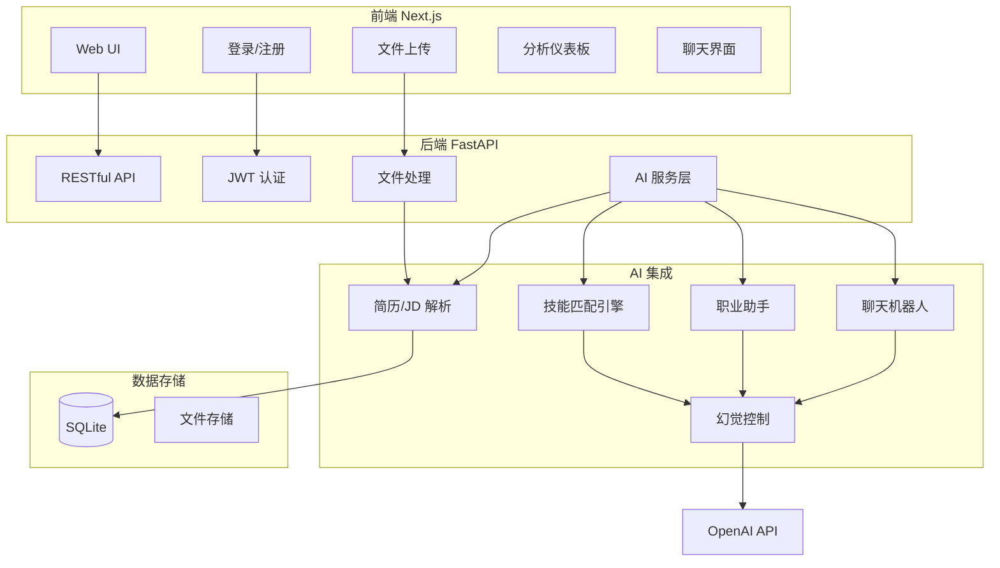

# AI 智能人才助手平台

基于 AI 的全栈人才助手：上传简历/职位描述，获取智能解析、技能匹配与职业建议。

## 系统架构



## 功能

- **用户认证**：注册、登录、JWT
- **文档上传**：支持 PDF、DOC、DOCX
- **AI 解析**：从简历/JD 中提取技能、经历、教育、职责
- **技能匹配**：简历与职位描述匹配，输出匹配分数、技能差距、改进建议
- **职业建议**：简历改进、技能路线图、学习建议
- **分析仪表板**：技能分布图、匹配分数、最近分析
- **AI 聊天助手**：基于上传资料解答职业问题
- **Docker 部署**：一键运行

## 技术栈

- 前端：Next.js 14、Tailwind CSS、Recharts、TanStack Query
- 后端：FastAPI、SQLAlchemy、SQLite
- AI：OpenAI GPT-4o-mini

## 快速开始

### 本地开发

**后端**

```bash
cd backend
python -m venv venv
source venv/bin/activate   # Windows: venv\Scripts\activate
pip install -r requirements.txt
mkdir -p data/uploads
uvicorn app.main:app --reload --host 0.0.0.0 --port 8000
```

**前端**

```bash
cd frontend
npm install
npm run dev
```

访问 http://localhost:3000

### 环境变量

创建 `backend/.env`：

```
OPENAI_API_KEY=sk-your-key
SECRET_KEY=your-secret-key
```

### Docker 部署

```bash
cp .env.example .env
# 编辑 .env 填入 OPENAI_API_KEY
docker-compose up --build
```

- 前端：http://localhost:3000
- 后端 API：http://localhost:8000
- API 文档：http://localhost:8000/docs

## API 概览

| 方法 | 路径 | 说明 |
|-----|------|------|
| POST | /api/auth/register | 注册 |
| POST | /api/auth/login | 登录 |
| GET | /api/users/me | 当前用户 |
| POST | /api/documents/upload | 上传文档 |
| GET | /api/documents/ | 文档列表 |
| GET | /api/documents/{id} | 文档详情与解析结果 |
| POST | /api/analysis/match | 简历-JD 匹配 |
| GET | /api/analysis/{id} | 匹配报告 |
| POST | /api/career/advice | 职业建议 |
| GET | /api/dashboard/stats | 仪表板统计 |
| POST | /api/chat | AI 聊天 |

## 项目结构

```
ai-talent-assistant/
├── docs/
│   └── PLAN.md        # 实现规划
├── frontend/          # Next.js
├── backend/           # FastAPI
│   ├── app/
│   │   ├── api/       # 路由
│   │   ├── core/      # 配置、认证、数据库
│   │   ├── models/    # ORM 模型
│   │   ├── schemas/   # Pydantic
│   │   └── services/  # AI、文件、聊天
│   └── requirements.txt
├── docker-compose.yml
└── README.md
```

## License

MIT
