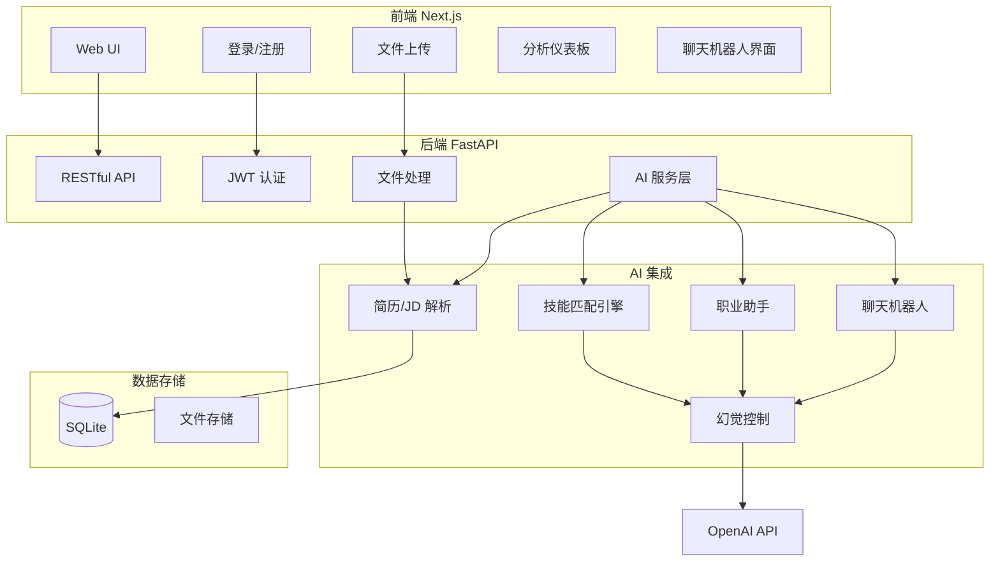

# AI 智能人才助手平台 - 实现规划

## 架构总览



---

## 1. 项目结构（Monorepo）

建议采用 Monorepo，便于前后端联调与 Docker 构建：

```
ai-talent-assistant/
├── frontend/                 # Next.js 前端
│   ├── app/
│   ├── components/
│   ├── lib/
│   └── package.json
├── backend/                  # FastAPI 后端
│   ├── app/
│   │   ├── api/
│   │   ├── core/
│   │   ├── models/
│   │   ├── services/
│   │   └── main.py
│   └── requirements.txt
├── docker-compose.yml
└── README.md
```

---

## 2. 后端实现（FastAPI）

### 2.1 核心模块

| 模块   | 职责                 | 关键文件                                  |
| ------ | -------------------- | ----------------------------------------- |
| 认证   | JWT 签发、登录/注册、密码哈希 | `app/core/auth.py`, `app/api/auth.py` |
| 文件   | PDF/DOC 上传、解析、存储    | `app/services/file_service.py`        |
| AI 服务 | 调用 OpenAI、提示工程、幻觉控制 | `app/services/ai_service.py`          |
| 数据库  | SQLAlchemy ORM、迁移   | `app/models/`, `app/core/database.py` |

### 2.2 API 设计（RESTful）

```
POST   /api/auth/register
POST   /api/auth/login
POST   /api/auth/logout
GET    /api/users/me

POST   /api/documents/upload        # 上传简历/JD
GET    /api/documents/{id}          # 获取解析结果
GET    /api/documents/              # 用户文档列表

POST   /api/analysis/match          # 简历-JD 匹配（传入 resume_id + jd_id）
GET    /api/analysis/{id}           # 获取分析结果

POST   /api/career/advice          # 职业建议（基于简历）
GET    /api/dashboard/stats        # 仪表板统计数据

POST   /api/chat                    # 聊天机器人消息（流式/非流式）
```

### 2.3 数据模型（SQLite）

- **User**: id, email, hashed_password, created_at
- **Document**: id, user_id, type(resume/jd), file_path, original_filename, created_at
- **ExtractionResult**: id, document_id, skills, experience, education, responsibilities (JSON)
- **MatchAnalysis**: id, resume_id, jd_id, match_score, skill_gaps, suggestions (JSON)
- **ChatMessage**: id, user_id, role, content, created_at

### 2.4 文件解析流程

1. 接收 PDF/DOC → 使用 `pypdf` / `python-docx` 提取文本
2. 文本送入 OpenAI，通过结构化提示（含 JSON Schema）提取：技能、经验、教育、职责
3. 结果入库，便于后续匹配与统计

---

## 3. AI 集成（OpenAI）

### 3.1 三大核心能力

1. **简历/JD 解析**
   - 模型：`gpt-4o-mini` 或 `gpt-4o`（按成本权衡）
   - 提示：明确输出 JSON 结构（skills[], experience[], education[], responsibilities[]）
   - 幻觉控制：严格 JSON 模式 + 仅提取原文存在的字段
2. **技能匹配引擎**
   - 输入：简历解析结果 + JD 解析结果
   - 输出：match_percentage, matched_skills[], skill_gaps[], improvement_suggestions[]
   - 幻觉控制：要求引用原文，不虚构技能或分数
3. **AI 职业助手**
   - 输入：简历解析结果 + 可选目标岗位
   - 输出：resume_tips[], skill_roadmap[], learning_suggestions[]

### 3.2 幻觉控制策略

- **结构化输出**：使用 `response_format: { type: "json_object" }` 限定格式
- **引用约束**：提示中明确 "仅基于上传文档内容，不编造信息"
- **置信度字段**：在解析结果中增加 `confidence` 或 `source_quote`
- **后处理校验**：对关键字段（如技能）与原文做简单相似度/包含校验

### 3.3 聊天机器人

- 上下文：用户上传的简历、JD、匹配分析结果
- 能力：回答职业相关问题、解释匹配结果、提供建议
- 实现：OpenAI Chat Completions API，维护会话历史（可存 Redis 或 SQLite）

---

## 4. 前端实现（Next.js）

### 4.1 技术栈

- **框架**：Next.js 14+ (App Router)
- **样式**：Tailwind CSS
- **图表**：Recharts
- **状态**：React Query (TanStack Query) + Context/Zustand
- **表单**：React Hook Form + Zod

### 4.2 页面与组件

| 页面     | 路径                 | 功能                         |
| -------- | -------------------- | ---------------------------- |
| 登录/注册 | `/login`, `/register` | 表单、JWT 存储               |
| 仪表板   | `/dashboard`         | 技能分布图、匹配分、职业路线   |
| 上传     | `/upload`            | 拖拽上传 PDF/DOC，选择类型(简历/JD) |
| 结果     | `/documents/[id]`    | 解析结果展示、技能标签       |
| 匹配分析 | `/analysis`          | 选择简历+JD，展示匹配报告    |
| 聊天     | `/chat` 或侧边栏      | 与 AI 对话                   |

### 4.3 关键实现点

- **文件上传**：`fetch` + `FormData`，显示进度条
- **API 集成**：封装 `fetch` 或 axios，统一处理 401 跳转登录
- **仪表板**：Recharts 饼图/柱状图展示技能分布；仪表盘展示匹配分数

---

## 5. Docker 化部署

### 5.1 多阶段构建

- **Frontend**：`node` 构建 → `nginx` 或 `node` 运行
- **Backend**：`python` 安装依赖 → 运行 `uvicorn`

### 5.2 docker-compose.yml

```yaml
services:
  frontend:
    build: ./frontend
    ports: ["3000:3000"]
    depends_on: [backend]
  backend:
    build: ./backend
    ports: ["8000:8000"]
    volumes: [./data:/app/data]  # SQLite + 上传文件持久化
    environment:
      - OPENAI_API_KEY=${OPENAI_API_KEY}
      - DATABASE_URL=sqlite:///./data/app.db
```

- 使用 `.env` 管理 `OPENAI_API_KEY`，不写入镜像
- SQLite 与上传目录挂载到本地 `./data`

---

## 6. 实现顺序建议

1. **Phase 1 - 基础骨架**
   - 前后端项目初始化，Docker 可构建可运行
   - JWT 认证、用户注册登录
   - 文件上传 + 文本解析（不含 AI）
2. **Phase 2 - AI 核心**
   - 简历/JD 解析（OpenAI）
   - 技能匹配引擎
   - 职业建议生成
   - 幻觉控制策略落地
3. **Phase 3 - 前端完善**
   - 解析结果展示、技能标签
   - 匹配分析页面
   - 仪表板图表（Recharts）
   - 职业路线可视化
4. **Phase 4 - 进阶功能**
   - 聊天机器人接口与前端
   - Docker Compose 整合、README 部署说明
   - 错误处理、日志、基础测试

---

## 7. 关键文件与依赖

**Backend (requirements.txt 核心)**

- fastapi, uvicorn, python-jose, passlib, sqlalchemy, pypdf, python-docx, openai, httpx

**Frontend (package.json 核心)**

- next, react, tailwindcss, recharts, @tanstack/react-query

**环境变量**

- `OPENAI_API_KEY`, `SECRET_KEY`, `DATABASE_URL`

---

## 8. 风险与注意点

- **成本**：OpenAI 按 token 计费，可在开发阶段用 `gpt-4o-mini` 降低成本
- **PDF 解析**：复杂版式 PDF 需考虑 `pdfplumber` 或 OCR（如需要）
- **安全**：文件类型校验、大小限制、路径遍历防护；JWT 过期时间合理设置
